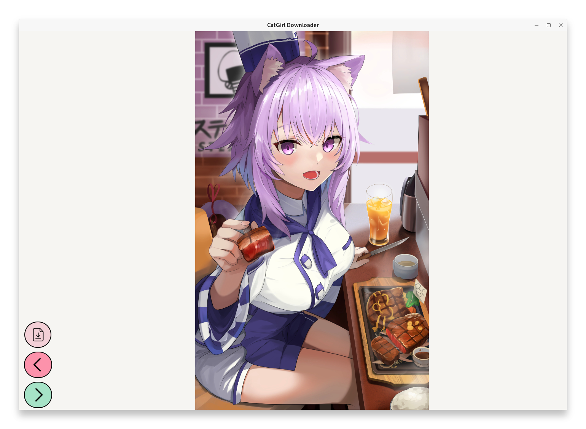

# CatGirl Downloader

A *quick* and easy to use C# avalonia MVVM application that helps you download kitties~

## Showcase


## Installation
Below you will find a guide on how to install Cargirl Downloader.

### Using releases page (Recommended)
Head on over to the [Releases Page](https://github.com/its-Lyn/CatGirlDownloader/releases)! <br>
Once you're there, simply click your OS's release for the app and extract it using your favourite `File Manager`. <br>

Now you can run the `setup.sh` file. This will create a desktop entry on your desktop for easy access!

### Compiling yourself (Advanced)
If you do not wish to use the release pages, you can also compile the app yourself.

#### Pre-requisities
To compile the app you require a few apps; `git`, `dotnet-sdk` and `dotnet-runtime`

```bash
# Ubuntu/Fedora
sudo apt/dnf install git dotnet-sdk-8.0 dotnet-runtime-8.0

# Arch based distributions
sudo pacman -S git dotnet-sdk dotnet-runtime
```

#### Compilation
Now, we can start installing the app! <br>
Begin by opening your favourite `terminal emulator`!

```
git clone https://github.com/its-Lyn/CatGirlDownloader
cd CatGirlDownloader
```

Instead of typing all the commands yourself I created a small script that will compile, move the resulting binary to its respective folder and create a desktop file. <br>
Simply type
```bash
chmod +x ./install.sh
./install.sh
```
Or... you can type 
```bash
dotnet publish -c Release -p:PublishSingleFile=true

# Your resulting binary is here
cd CatGirlDownloader/bin/Release/net-8.0/linux-<cpu-arch>/publish
```
and move the binaries where ever you want.

## Uninstalling
Uninstall CatGirlDownloader is as easy as running one command!
```bash
# If you used the Releases Page
./setup.sh --remove

# If you git cloned
./install.sh --remove
```

## Keybinds
When running the app, instead of the buttons you can use the keybinds described below.

| Keybind  | Description            |
|----------|------------------------|
| Ctrl + S | Save image locally.    |
| Ctrl + N | Fetch the next image.  |
| Ctrl + P | Go back to last image. |  

## Credits
This app's existence is only possible because of [nekos.best](https://nekos.best/)! <br>
All icons used are sourced from [flaticon](https://www.flaticon.com)!

## License
MIT